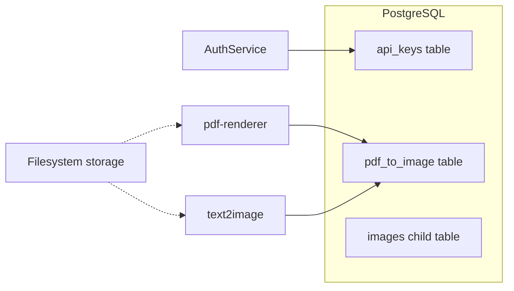

# PostgreSQL database plan (self-hosted)

## Implementation checklist

- [X] Create DB and role `svc-content-process` (SCRAM), least-privilege grants, TLS for remote connection
- [X] Create two databases - one for prod named `content-processing` and for dev named `dev-content-processing`
- [ ] Use ORM (EF Core / SQLAlchemy) for models and queries; Use Flyway for migrations, written in SQL; add initial migration to repo
- [ ] Align Postgres backup with filesystem backup for path consistency on restore

---

## Context

The repo ([README.md](../../README.md)) describes **auth** (API keys), **pdf-renderer**, and **text2image** on Windows Server. There is **no database code in the codebase yet**; this plan is **greenfield** for schema and server setup.

## Server and roles

- **PostgreSQL**: install on the same host or a nearby VM; enable TLS for remote clients if not localhost-only.
- **`svc-content-process`**: **application database role**. Create it with a strong password or (better) **SCRAM** auth; superuser should **not** be used for the app.
- **Privileges**: grant `CONNECT` on the database and `USAGE` on schema dedicated `app`. Granted `SELECT` / `INSERT` / `UPDATE` / `DELETE` only on tables the services need. 

- Revoke public defaults on new DBs if you follow hardening guides - SHOULD BE DONE!

Optional: separate roles per service (`auth` vs `worker`) if you want tighter blast radius later.

### Network access (DB on same server as apps; dev machines + deployed apps)

**Deployed applications (same host):** use **`127.0.0.1`** (or `localhost`) and the normal Postgres port in the connection string. Traffic stays on the loopback interface and does **not** need Postgres to listen on the public/LAN IP. Prefer this for auth/pdf/text2image when they run on that server.

**Developer machines (remote):** you need a *controlled* path to Postgres:

1. **SSH tunnel (strong default):** Postgres keeps `listen_addresses` limited (e.g. `localhost` only). On your dev machine: forward a local port to the server’s `127.0.0.1:5432`. You connect to `127.0.0.1:<local_port>` from tools (psql, DBeaver, app). No need to expose `5432` on the firewall; uses existing SSH access.

**Configuration checklist:**

- **`postgresql.conf`:** `listen_addresses` — `localhost` only if everything uses loopback + SSH tunnel;
- **`pg_hba.conf`:** separate rules: `local` / `host` for `127.0.0.1` (SCRAM); for remote
- **TLS:** require SSL for any non-local connection (`ssl = on` in server config; client `sslmode=require` or `verify-full`).

**Summary:** Same-server apps → **`127.0.0.1`**. Remote devs → **SSH tunnel**

---

## 1) API keys

**Goal:** whoever holds the DB backup should **not** be able to use API keys as-is.

| Approach                                                 | Pros                                              | Cons                                                                       |
| -------------------------------------------------------- | ------------------------------------------------- | -------------------------------------------------------------------------- |
| **Store only a hash of the secret** (recommended)        | Same model as passwords; leak of DB ≠ usable keys | You show the plaintext **once** at creation; lost key = revoke + issue new |
| **Encrypt secret** (e.g. `pgcrypto`, app-layer envelope) | Retrievable plaintext                             | Key management burden; weaker if DEK leaks                                 |
| **External vault**                                       | Strong isolation                                  | Extra ops complexity for a small platform                                  |

**Auth service:**

1. Client receives: **`key_id`** (stable public identifier, UUID) + **`secret`** (high-entropy random string, shown **once**).
2. DB stores: `key_id`, **`secret_hash`** (e.g. **SHA-256** of `secret` with optional **application-level pepper** from env — not stored in DB), `created_at`, `expires_at` (nullable), `revoked_at` (nullable), **`scopes`** or JSONB for fine rules, **`name`** / **`created_by`** for ops.
3. Lookup: client sends `Authorization: Bearer <secret>` or `X-Api-Key`; you **hash** incoming secret and compare to `secret_hash` (constant-time compare in app code).
4. **Rotation**: add row for new key, migrate clients, set `revoked_at` on old row (or soft-delete).
5. **Indexing**: index `key_id`; do **not** index raw secret or raw hash if you use random lookups — you typically look up by `key_id` from a prefixed key (`key_id.secret`) or by hash only if the key embeds no id (less common).

**Prefix format (common):** e.g. `cp_` + `key_id` + `_` + `secret_part` so Auth can route to the right row without scanning.

**What not to do:** store plaintext secrets in Postgres; log full keys in application logs.

- Binaries on disk (or UNC/SMB share on Windows), **relative or absolute paths in DB**, plus metadata for integrity and workflow.

- **`pdf_to_image`**: `id`, **`pdf_path`**, **`image_id`** (nullable until rendered), **`pdf_sha256`**, **`status`** (`pending` / `processing` / `complete` / `failed`), **`error_message`**, **`created_at`**, **`updated_at`**.
- Child table **`images`** with `id`, `image_path`, **`image_sha256`**, `page_index`, etc.

**Path rules:**

- **Paths relative to a configured root** (e.g. `ContentRoot` in appsettings)
— store `relative_path` and join in app code.
- Normalize separators for Windows (`\` vs `/`) in one layer (application).
- Enforce **max length** (e.g. `TEXT` is fine; validate length in app).

**Concurrency:** use transactions when updating `status` and paths so partial failures do not leave inconsistent state.

- **AuthService**: read/write `api_keys` (or a view limited to non-sensitive columns for admins).
- **pdf-renderer / text2image**: read/write `pdf-to-image`, `images`

---

## 2) Migration and versioning

- Use ORM (EF Core + SQLAlchemy) for:
  - models
  - queries
- Use Flyway for:
  -migrations (written in SQL)
- Add a **migrations** folder; **Flyway** will run on deploy.
- First migration: create tables, indexes, and `svc-content-process` grants.

| Environment   | DB_HOST    | DB_NAME                     | DB_USER                        | DB_PASSWORD      |
| ------------- | ---------- | --------------------------- | ------------------------------ | ---------------- |
| Development   | localhost  | dev_content_processing      | dev_svc_content_process        | **dev_pass**     |
| Staging       | localhost  | staging_content_processing  | staging_svc_content_process    | **staging_pass** |
| Production    | localhost  | content_processing          | svc_content_process            | **prod_pass**    |

- Application database user - svc_content_process
- Migration database user - flyway_migrator

### 1 Repo layout + Flyway skeleton (folders, files, naming rules)
### 2	Postgres: create migrator vs svc-content-process (privileges, ownership)
### 3	First versioned migration: CREATE SCHEMA / tables / indexes / GRANT pattern
### 4	Flyway config: JDBC URL, users from env/secrets, Windows-friendly invocation
### 5	Local verification (dev DB, migrate, info)
### 6	GitHub Actions: where Flyway runs (staging/prod), secrets, job order vs deploy
### 7	Windows Service deploy: migrate before service start; rollback story

---

## 3) Backup and retention

- Include Postgres in your backup policy (base backup + WAL if you need PITR).
- Filesystem and DB backups should be **correlated** (restore runbook: restore DB then re-link paths, or restore volume snapshot + DB from same time).

- **One DB for dev and one DB for prod:** each database with two schemas (`auth`, `app`).

### Useful psql commands

psql -U user -d database_name

CREATE ROLE role_name LOGIN PASSWORD 'password';

SELECT rolname, rolcanlogin, rolsuper FROM pg_roles WHERE rolname = 'user';

REVOKE ALL ON DATABASE content_processing FROM PUBLIC;
REVOKE ALL ON DATABASE dev_content_processing FROM PUBLIC;
REVOKE ALL ON SCHEMA public FROM PUBLIC;
GRANT CREATE ON DATABASE content_processing TO flyway_migrator;

SELECT has_database_privilege('flyway_migrator', 'content_processing', 'CREATE');

GRANT CREATE ON DATABASE dev_content_processing TO flyway_migrator;

SELECT has_database_privilege('flyway_migrator', 'dev_content_processing', 'CREATE');
